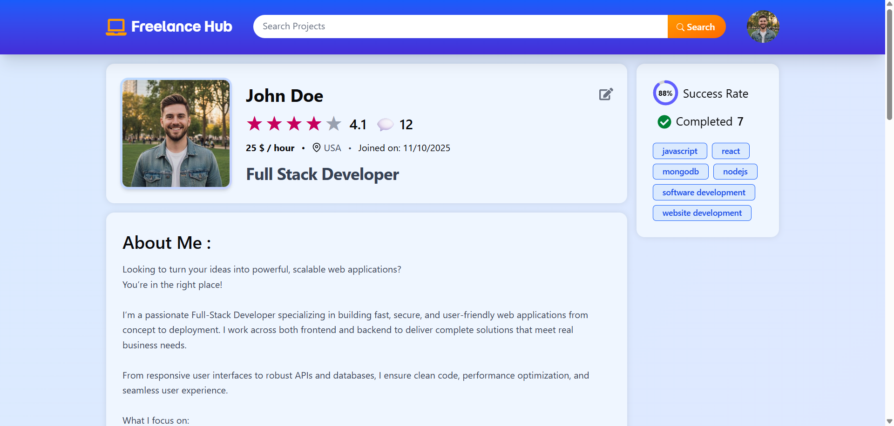
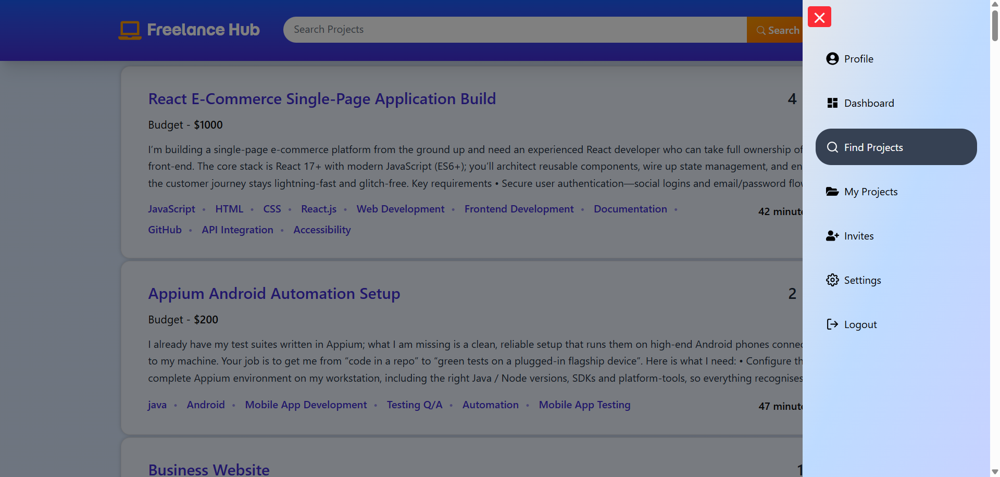

# 💻 Freelance Hub - A Client-Freelancer Collaboration Platform

**Freelance Hub** is a modern **Client–Freelancer Collaboration Platform** designed to connect clients and freelancers seamlessly. The platform enables project posting, freelancer discovery, secure authentication, real-time collaboration readiness, and scalable architecture using the MERN ecosystem.

---

## 🚀 Live Demo

🔗 [freelance-hub-ten-chi.vercel.app](freelance-hub-ten-chi.vercel.app)

---

## 🌟 Features

### 👤 User Management

- Secure authentication using **JWT**
- Password hashing with **bcryptjs**
- Role-based access (Client / Freelancer)

### 📁 Project & Collaboration

- Clients can post and manage projects
- Freelancers can apply and collaborate
- Invitation-based project workflow

### 🖼 Media Handling

- File & image uploads using **Multer**
- Cloud storage integration with **Cloudinary**

### 🔒 Security & Performance

- **Helmet** for secure HTTP headers
- **Rate limiting** to prevent abuse
- Centralized error handling with proper HTTP status codes

### 🎨 Modern UI

- Fully responsive design using **Tailwind CSS**
- Clean, minimal, and modern interface

---

## Project Overview

### Freelancer Profile



### Projects and Sidebar



## 🧰 Tech Stack

### 🎨 Frontend

- ⚛️ **React 19** with **Vite** – lightning-fast development & builds
- 🧭 **React Router DOM** – seamless client-side routing
- 🎨 **Tailwind CSS 4** – utility-first, modern styling
- 📝 **React Hook Form** – performant forms with schema validation
- 🔗 **Axios** – promise-based API communication
- 🔔 **React Toastify** – elegant notifications & alerts
- 🎯 **Lucide React / React Icons** – clean, scalable iconography

### ⚙️ Backend

- 🟢 **Node.js** + **Express 5** – robust and scalable server architecture
- 🍃 **MongoDB** + **Mongoose** – flexible NoSQL database with ODM
- 🔐 **JWT Authentication** – secure, token-based auth system
- ✅ **Joi** – request validation & data integrity
- 📤 **Multer** + ☁️ **Cloudinary** – file uploads & cloud media storage
- 🛡 **Helmet**, 🌍 **CORS**, 🚦 **Express Rate Limit** – security & performance hardening

---

## ⚙️ Installation & Setup

### 1️⃣ Clone the Repository

```bash
git clone https://github.com/your-username/freelance-hub.git
cd freelance-hub
```

### 2️⃣ Frontend Setup

```bash
cd frontend
npm install
npm run dev
```

### 3️⃣ Backend Setup

```bash
cd backend
npm install
npm start
```

---

## 🔑 Environment Variables (Backend)

Create a `.env` file inside the `backend` folder:

```env
PORT=5000

MONGO_URI=your_mongodb_connection_string
JWT_SECRET=your_jwt_secret
JWT_LIFETIME=your_auth_token_expiry

CLOUDINARY_CLOUD_NAME=your_cloud_name
CLOUDINARY_API_KEY=your_api_key
CLOUDINARY_API_SECRET=your_api_secret
```

---

## 📈 Future Enhancements

- Real-time chat using **Socket.IO**
- Payment gateway integration

---

## 🤝 Contributing

Contributions are welcome! Feel free to fork the repository and submit a pull request.

---

## 👨‍💻 Author

**Vivek**
Full Stack Developer (MERN)

---

⭐ If you like this project, don’t forget to star the repository!
